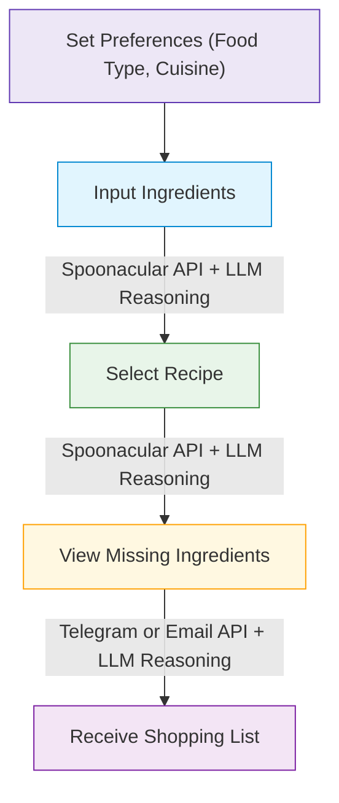
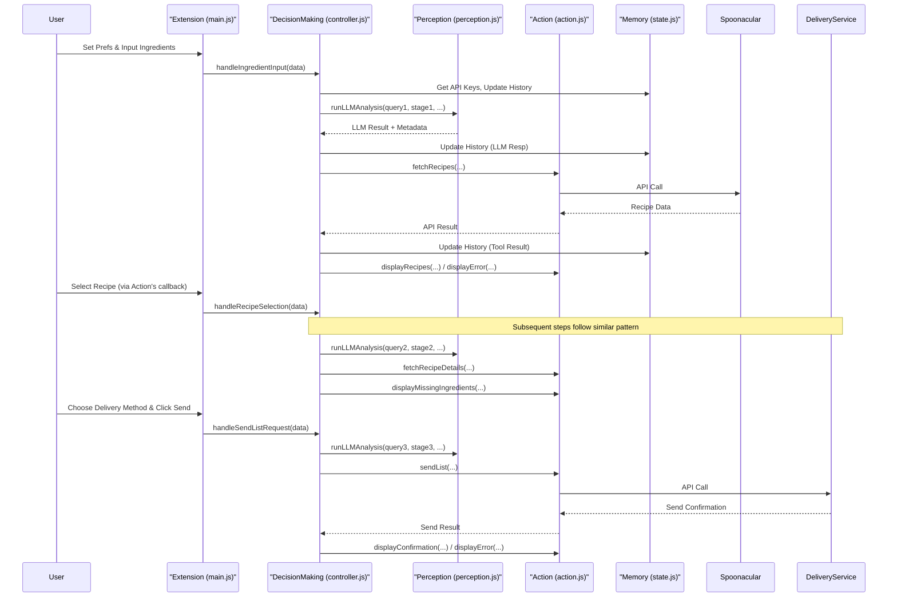
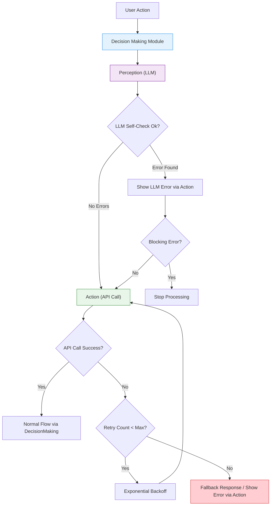

# Recipe Suggester and Shopping List Generator Chrome Plugin

This Chrome extension harnesses the power of multi-step agentic workflows with structured reasoning to help you discover recipes based on ingredients you already have and generate shopping lists for any missing items.


## Table of Contents
- [Features](#features)
- [Installation](#installation)
- [How It Works](#how-it-works)
- [API Configuration](#api-configuration)
- [Advanced Reasoning Capabilities](#advanced-reasoning-capabilities)
- [Workflow Diagrams](#workflow-diagrams)
- [Technical Architecture](#technical-architecture)
- [Development](#development)
- [Limitations](#limitations)
- [License](#license)

## Features

- 🗣️ **User Preferences**: Specify food type (Vegetarian, Vegan, etc.) and cuisine preferences.
- 🔍 **Ingredient-Based Recipe Search**: Find recipes based on what's already in your kitchen and your preferences.
- 📋 **Automatic Missing Ingredient Detection**: Identify what you need to buy for your selected recipe.
- 📱 **Multi-Channel Delivery**: Send shopping lists via Telegram or Email.
- 🧠 **Multi-Step Agentic Workflow**: Maintains context between steps for a coherent experience.
- 🤔 **Explicit Reasoning & Self-Checks**: AI-powered verification at each step.
- 🧩 **Reasoning Type Awareness**: Identifies different reasoning styles (logical, creative, etc.).
- 🛡️ **Robust Error Handling**: Multiple fallback mechanisms and detailed error messages.
- 🔄 **Conversation Loop Support**: Maintains comprehensive context across workflow steps.
- 🚧 **Graceful Degradation**: Falls back to simulated responses when APIs or LLM are unavailable.
- 🔒 **Secure API Key Management**: Store your API keys securely in Chrome's sync storage.
- 🏗️ **Modular Architecture**: Code organized into cognitive layers (Memory, Perception, Decision-Making, Action).

## Installation

### From Source
1. Clone this repository or download the ZIP file.
2. Open Chrome and navigate to `chrome://extensions/`.
3. Enable "Developer mode" using the toggle in the top right.
4. Click "Load unpacked" and select the directory containing the extension files (the root directory, not the `js/` subdirectory).
5. The Recipe Suggester icon should now appear in your Chrome toolbar.

## How It Works

The plugin utilizes a 4-step process, starting with user preferences, and incorporating intelligent reasoning at each stage:



### Step 0: Set Preferences
Optionally select your preferred food type (e.g., Vegetarian, Vegan) and cuisine (e.g., Indian, Italian) from the dropdowns.

### Step 1: Input Your Ingredients
Enter ingredients you have available, separated by commas. The LLM performs a self-check on the ingredients and preferences, validating them before searching for appropriate recipes.

### Step 2: Select a Recipe
Browse suggested recipes that use your available ingredients and match your preferences (where possible). The LLM maintains context from step 1 and incorporates it into reasoning.

### Step 3: View Missing Ingredients
See what additional items you need to buy for the chosen recipe. The LLM analyzes the missing ingredients and prepares them for delivery using structured reasoning.

### Step 4: Receive Your Shopping List
Get your shopping list delivered via your preferred method (Telegram or Email) with appropriate formatting and context.

## API Configuration

This extension requires the following API keys:

- **Gemini API**: For LLM-powered reasoning and decision-making.
- **Spoonacular API**: For recipe suggestions and ingredient analysis.
- **Telegram Bot API** or **SendGrid API**: For delivering shopping lists.

To configure your API keys:
1. Click the gear icon (⚙️) in the top-right corner of the extension popup.
2. Enter your API keys in the designated fields.
3. Click "Save Configuration".

### Free API Tiers
- **Gemini API**: Free tier available with limits.
- **Spoonacular API**: Free tier available (check their site for current limits, often around 150 points/day).
- **Telegram Bot API**: Free for all usage.
- **SendGrid API**: Free tier available (e.g., 100 emails/day).

## Advanced Reasoning Capabilities

### Explicit Reasoning Instructions
The extension prompts the LLM to think step-by-step about each request, breaking down the problem into components and explaining the reasoning process.

### Reasoning Type Awareness
The LLM identifies different reasoning types needed for each subtask (ARITHMETIC, RETRIEVAL, COMPARISON, LOGICAL, CAUSAL, ANALOGICAL, CREATIVE, SOCIAL).

### Internal Self-Checks
Before proceeding with each step, the LLM performs a self-check to verify input validity, context retention, tool selection appropriateness, data consistency, and **user preferences**.

Example self-check for Step 1 (from code):
```javascript
// Inside buildReasoningPrompt for stage 1:
// ...
// SELF-CHECK:
// 1. Verify that you've correctly identified all the ingredients provided. Are they plausible cooking ingredients?
// 2. Identify any stated user preferences (like food type or cuisine) within the query. Are they clear?
// ...
// 5. Validate that the Spoonacular API (recipe search by ingredients) is the right tool for this query, considering preferences.
// ...
```

### Uncertainty and Error Handling
The LLM explicitly marks uncertainties (`[UNCERTAINTY: X]`) and errors (`[ERROR: X]`) during its reasoning process.

### Structured Output Format
All LLM responses follow a consistent format with clearly labeled reasoning types, self-checks, uncertainties, and errors, making the reasoning process transparent and debuggable.

## Workflow Diagrams

### Enhanced Multi-Step Agentic Workflow
Each step maintains deep context from previous interactions, including user preferences and reasoning metadata:



### Enhanced Error Handling Flow



## Technical Architecture

The extension's JavaScript code is modularized into distinct cognitive layers, promoting separation of concerns.

### Files Structure
```
eag-assignment-6/
├── js/                  # JavaScript modules
│   ├── main.js         # Entry point, UI event wiring
│   ├── state.js       # State management (history, API keys)
│   ├── perception.js   # LLM interactions (Gemini)
│   ├── controller.js # Workflow logic, orchestration
│   └── action.js       # UI updates, External API calls
├── images/              # Icons
├── .gitignore
├── background.js        # Background service worker (minimal use)
├── manifest.json        # Extension configuration
├── popup.html           # Main user interface
├── styles.css           # UI styling
└── README.md            # This file
```

### Module Responsibilities

*   **`main.js`**: The entry point loaded by `popup.html`. Initializes other modules, gets references to DOM elements (via `action.js`), sets up UI event listeners, and delegates event handling logic to `controller.js`.
*   **`state.js`**: Manages the application's state. It holds the `conversationHistory`, stores and retrieves API keys using `chrome.storage.sync`, and provides functions to safely access and update this state. It is the single source of truth for conversation context and configuration.
*   **`perception.js`**: Handles all direct communication with the Large Language Model (LLM - Gemini). It builds reasoning prompts, makes the API calls to the LLM, implements LLM-specific retry logic, and parses the LLM's response, extracting structured metadata (reasoning types, self-checks, errors, uncertainties).
*   **`controller.js`**: Acts as the central orchestrator or "brain" of the agent. It contains the core workflow logic for each step. It receives triggers from `main.js`, retrieves state from `state.js`, calls `perception.js` for analysis, interprets results, decides the next action (like calling an external API or updating the UI via `action.js`), and updates the state via `state.js`.
*   **`action.js`**: Executes all side effects – interactions with the "outside world". This includes manipulating the DOM (updating the UI, showing/hiding elements, displaying messages) and making external API calls (Spoonacular, Telegram, SendGrid), including API-specific retry logic.

### Retry and Fallback Mechanisms
The extension implements sophisticated retry and fallback logic:

1.  **LLM Retries**: (`perception.js`) Multiple attempts with exponential backoff for LLM API calls.
2.  **API Retries**: (`action.js`) Multiple attempts with backoff for external API calls (Spoonacular, Telegram, SendGrid).
3.  **Fallback Response Generation**: (`perception.js`) When LLM is unavailable after retries, provides context-aware simulated responses.
4.  **Fallback Ingredients**: (`action.js`) Generates plausible ingredients when the recipe details API fails.
5.  **Non-Blocking vs. Blocking Errors**: (`action.js`) Differentiates how critical and non-critical issues are displayed to the user.

## Development

### Prerequisites
- Chrome browser
- Basic knowledge of HTML, CSS, and JavaScript (including ES6 Modules)
- API keys for Gemini, Spoonacular, Telegram and/or SendGrid

### Modifying the Extension
1. The core logic is now split across the files in the `js/` directory. Identify the relevant module (`memory`, `perception`, `decision-making`, `action`) for your change.
2. Update the files as needed.
3. Reload the extension in `chrome://extensions/` after making changes.

### Adding Features
The modular structure facilitates adding features:
- Add new delivery methods by extending the UI in `popup.html`, adding API call logic in `action.js`, and updating the handling in `controller.js`.
- Enhance reasoning by modifying prompt templates in `perception.js`.
- Add new state variables by updating `state.js`.

## Limitations

- Recipe suggestions are limited by the Spoonacular API's capabilities and data.
- Preference filtering relies on Spoonacular's API parameters, which might not cover all cuisines or dietary nuances perfectly.
- Free API tiers have usage limits.
- LLM (Gemini) API may have occasional downtime or rate limits.
- Ingredient matching logic (`controller.js`) is basic and may not perfectly handle all variations (e.g., "onion" vs "red onion").

